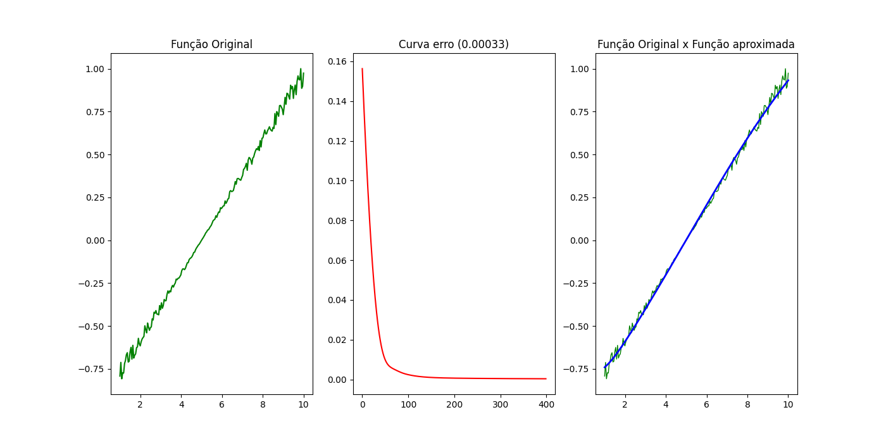
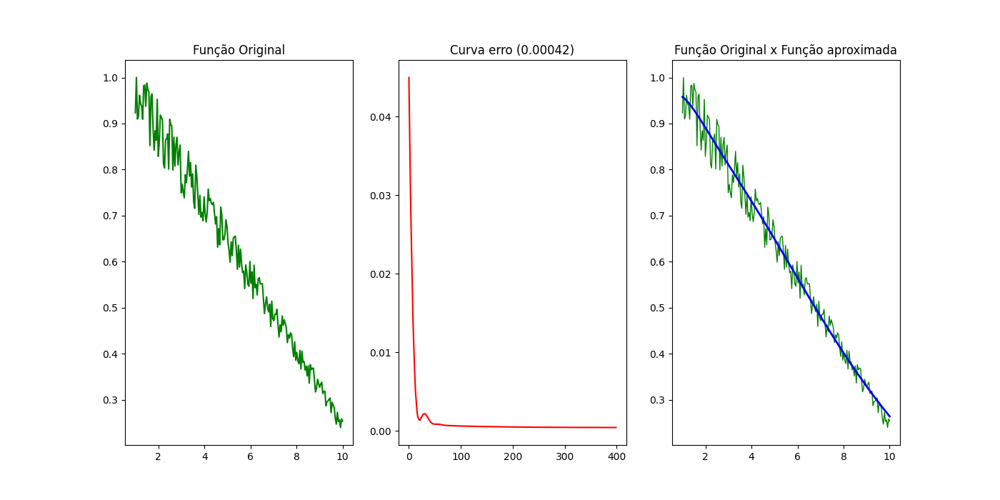
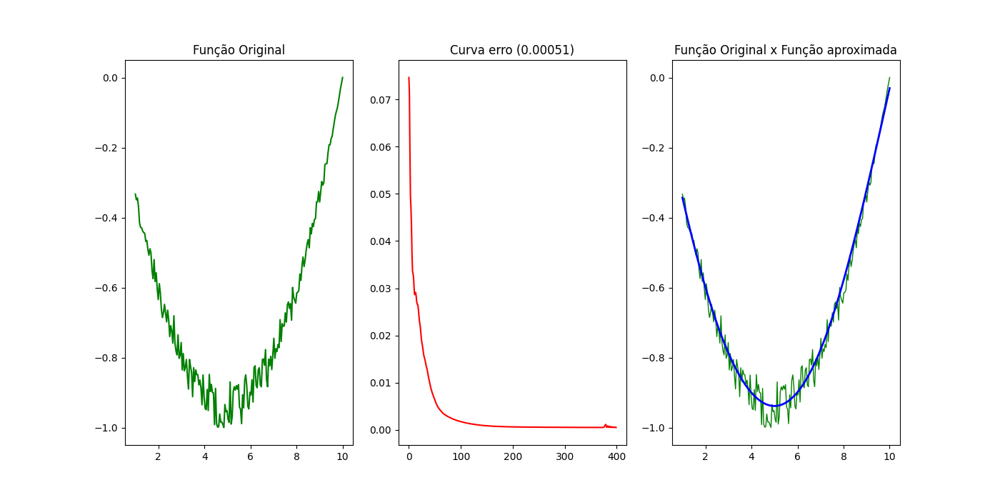
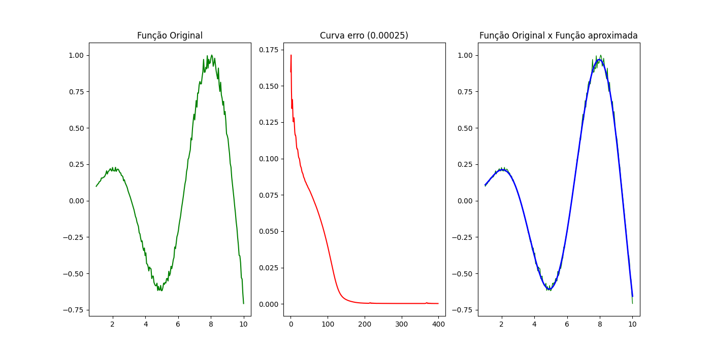
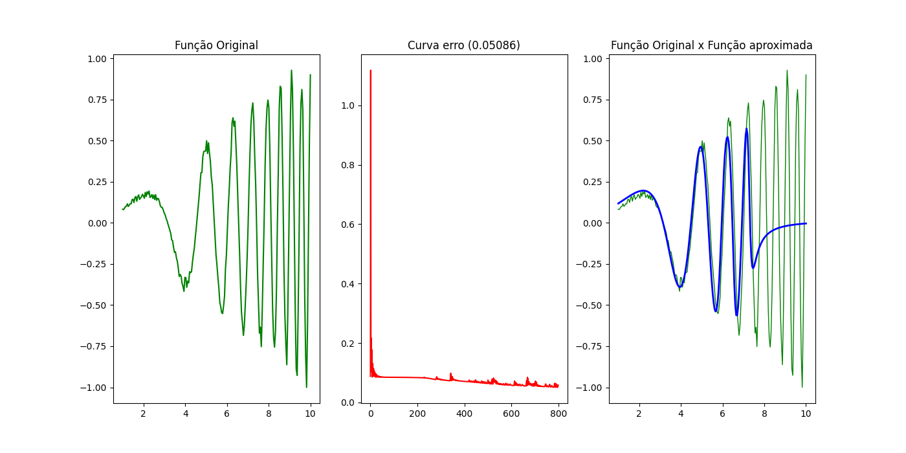

# RNA - Aproximador de Funções

## Teste 1
### Valores das camadas: 
2 camadas, sendo a primeira com 20 neurônios e a segunda com 15 neurônios 

### Valores dos erros
| Plotagem   | Valor                         |
|------------|-------------------------------|
| Plotagem 1 | 0.0012399546014561411         |
| Plotagem 2 | 0.00043834646999709           |
| Plotagem 3 | 0.0010254364744844723         |
| Plotagem 4 | 0.00035938502269058497        |
| Plotagem 5 | 0.0025537324166437793         |
| Plotagem 6 | 0.0003286019350770996         |
| Plotagem 7 | 0.0011567797387195939         |
| Plotagem 8 | 0.0008357818562296309         |
| Plotagem 9 | 0.0008068837931497594         |
| Plotagem 10| 0.0009263008536027064         |

### Média e Desvio Padrão
|                 | Média                         | Desvio Padrão                |
|-----------------|-------------------------------|------------------------------|
| **Valor**       | 0.0009671203162050859         | 0.0006439797640629996        |

### Melhor Plotagem (Gráfico 6)

## Teste 2
### Valores das camadas: 
2 camadas, sendo a primeira com 30 neurônios e a segunda com 40 neurônios 

### Valores dos erros
| Plotagem   | Valor                         |
|------------|-------------------------------|
| Plotagem 1 | 0.0005425612352429257         |
| Plotagem 2 | 0.00047868203508291435        |
| Plotagem 3 | 0.00045390103315081205        |
| Plotagem 4 | 0.000602236089948713          |
| Plotagem 5 | 0.0004179919240357318         |
| Plotagem 6 | 0.0006146798263120491         |
| Plotagem 7 | 0.0006953730586136992         |
| Plotagem 8 | 0.0005037357280263862         |
| Plotagem 9 | 0.0006207963911790327         |
| Plotagem 10| 0.0004919693099354925         |

### Média e Desvio Padrão
|                 | Média                         | Desvio Padrão                |
|-----------------|-------------------------------|------------------------------|
| **Valor**       | 0.0005421926631527757         | 8.803955793594514e-05        |

### Melhor Plotagem (Gráfico 5)

## Teste 3
### Valores das camadas: 
3 camadas, sendo a primeira com 50 neurônios, a segunda com 30 neurônios e a terceira com 40 neurônios  

### Valores dos erros
| Plotagem   | Valor                         |
|------------|-------------------------------|
| Plotagem 1 | 0.0025356538292240407         |
| Plotagem 2 | 0.0006285687698152972         |
| Plotagem 3 | 0.0006423184352199927         |
| Plotagem 4 | 0.0012240265169166083         |
| Plotagem 5 | 0.0008236836652802669         |
| Plotagem 6 | 0.002555209078332683          |
| Plotagem 7 | 0.0005590828147605607         |
| Plotagem 8 | 0.000713986647398713          |
| Plotagem 9 | 0.0005297249704361433         |
| Plotagem 10| 0.0005051724708275756         |

### Média e Desvio Padrão
|                 | Média                         | Desvio Padrão                |
|-----------------|-------------------------------|------------------------------|
| **Valor**       | 0.001071742719821188         | 0.0008037989564796586         |

### Melhor Plotagem (Gráfico 10)

## Teste 4
### Valores das camadas: 
4 camadas cada uma com 50 neurônios cada 

### Valores dos erros
| Plotagem   | Valor                         |
|------------|-------------------------------|
| Plotagem 1 | 0.00026759812141490517        |
| Plotagem 2 | 0.0002525274120720722         |
| Plotagem 3 | 0.00025025032624110676        |
| Plotagem 4 | 0.0004872728875410467         |
| Plotagem 5 | 0.0017660810740340637         |
| Plotagem 6 | 0.00027269795222060165        |
| Plotagem 7 | 0.001115421004602004          |
| Plotagem 8 | 0.000696193086523393          |
| Plotagem 9 | 0.00026566930204068343        |
| Plotagem 10| 0.0006615255401493204         |

### Média e Desvio Padrão
|                 | Média                         | Desvio Padrão                |
|-----------------|-------------------------------|------------------------------|
| **Valor**       | 0.0006035236706839198         | 0.0004970448574821009        |

### Melhor Plotagem (Gráfico 3)

## Teste 5
### Valores das camadas: 
16 camadas cada uma com 100 neurônios cada (também aumentamos a quantidade de iterações de 400 para 800) 

### Valores dos erros
| Plotagem   | Valor                         |
|------------|-------------------------------|
| Plotagem 1 | 0.06537915646181786           |
| Plotagem 2 | 0.0525451076419955            |
| Plotagem 3 | 0.051544783949419276          |
| Plotagem 4 | 0.057910314673456795          |
| Plotagem 5 | 0.052897046028559325          |
| Plotagem 6 | 0.050857559601285705          |
| Plotagem 7 | 0.05558367177239312           |
| Plotagem 8 | 0.06537409866888431           |
| Plotagem 9 | 0.05926588425701259           |
| Plotagem 10| 0.05575489218084668           |

### Média e Desvio Padrão
|                 | Média                         | Desvio Padrão                |
|-----------------|-------------------------------|------------------------------|
| **Valor**       | 0.05671125152356712           | 0.005303986671733825         |

### Melhor Plotagem (Gráfico 6)
